```mermaid
flowchart LR
    subgraph AWS
        A[Amazon Connect Agent Call] --> B[AWS Lambda Trigger]
        B --> C[Lambda: Get OAuth2 Token via Epic Token Endpoint]
        C --> D[Lambda: Patient Search via FHIR /Patient?telecom=+1...]
    end

    D -->|Returns JSON Patient Bundle| E[Amazon Connect CCP UI]
    E -->|Screen Pop Request| F[Epic Hyperdrive Launch /launch]
    F --> G[Epic FHIR Server]

    subgraph Epic Cloud
        G --> H[Epic Authorization Server /oauth2]
        H --> I[Epic FHIR /Patient, /Appointment, /Account]
    end

    classDef aws fill:#f7f9fb,stroke:#FF9900,stroke-width:2px;
    classDef epic fill:#f8f8ff,stroke:#0072CE,stroke-width:2px;
    class A,B,C,D,E,F aws;
    class G,H,I epic;
```

# Epic-Patient-Lookup-for-Amazon-Connect
This app automatically searches Epic using the caller’s phone number (ANI) and the servicing agent’s context, then opens the matching patient record in the agent’s Epic workspace.

## Overview
**Epic Patient Lookup for Amazon Connect** is a SMART on FHIR–compliant integration that enables Amazon Connect contact center agents and backend AWS services to securely retrieve patient demographic data from Epic.  

It supports:
- Automated FHIR lookups by **phone number** or **name/DOB** when a call is received in Amazon Connect.
- **Screen-pop** of the patient’s Epic chart context within Hyperdrive or browser-based workflows.
- **FHIR-based** data retrieval for backend integrations using Epic’s public sandbox or production FHIR endpoints.

This integration was developed by **The Chicago Lighthouse** to streamline patient identification in HIPAA-regulated contact centers.

---

## Key Features
- 🔍 **FHIR-based patient search:** Uses `Patient.Search (Demographics)` and `$match`.
- ☁️ **Amazon Connect integration:** Lookup triggered automatically when a call arrives.
- 🧠 **Epic Hyperdrive support:** Allows EHR launch using SMART-on-FHIR `iss` and `launch` parameters.
- 🔐 **OAuth 2.0 Authorization:** Supports both **Authorization Code** and **Client Credentials** flows.
- ⚙️ **AWS-native implementation:** Lambda + API Gateway architecture with no persistent storage.

---

## Intended Users
| User Type | Description |
|------------|-------------|
| **Backend Systems** | Amazon Connect + Lambda functions performing FHIR lookups. |
| **Clinicians / Staff** | Contact-center agents using Citrix/Hyperdrive who view Epic patient records. |
| **Patients / External** | Not applicable — this is a staff-only integration. |

---

## Supported FHIR APIs

| Endpoint | Description | Version |
|-----------|-------------|----------|
| `Patient.Search (Demographics)` | Search for a patient by name, DOB, or telecom (phone). | R4 |
| `Patient.$match` | Match patient records probabilistically based on identifiers. | R4 |
| `Appointment.Search` | Retrieve upcoming appointments for identified patients. | R4 |

More details: [Epic FHIR Sandbox](https://vendorservices.epic.com/Sandbox?api=10505)

---

## SMART on FHIR Configuration

| Setting | Value |
|----------|--------|
| **FHIR Base URL** | `https://fhir.epic.com/interconnect-fhir-oauth/api/FHIR/R4` |
| **Authorization Endpoint** | `https://fhir.epic.com/interconnect-fhir-oauth/oauth2/authorize` |
| **Token Endpoint** | `https://fhir.epic.com/interconnect-fhir-oauth/oauth2/token` |
| **SMART Version** | R4 |
| **Grant Types** | `authorization_code`, `client_credentials`, `refresh_token` |
| **Code Challenge** | `S256` (PKCE) |
| **Auth Methods Supported** | `client_secret_post`, `client_secret_basic`, `private_key_jwt` |

---

## OAuth 2.0 Scopes

```
launch openid fhirUser patient/*.read offline_access
```

### Example Authorization Request
```
GET https://fhir.epic.com/interconnect-fhir-oauth/oauth2/authorize?
  response_type=code&
  client_id=<your_client_id>&
  redirect_uri=https%3A%2F%2Fconnect-launch.mycompany.com%2Fcallback&
  scope=launch%20openid%20fhirUser%20patient%2F*.read&
  aud=https%3A%2F%2Ffhir.epic.com%2Finterconnect-fhir-oauth%2Fapi%2FFHIR%2FR4&
  state=xyz&nonce=abc&code_challenge=abc123&code_challenge_method=S256
```

---

## App Endpoints

| Endpoint | Method | Description |
|-----------|--------|-------------|
| `/launch` | GET | Accepts `iss` and `launch` parameters from Epic Hyperdrive or Test Harness. |
| `/callback` | GET | Handles Epic redirect with authorization `code`; exchanges it for tokens. |
| `/fhir` | POST | (Optional) Internal endpoint for Lambda to perform service-level FHIR lookups. |

---

## 🧭 Architecture Diagram



---

## ⚙️ Try It in Postman

### 1️⃣ Get a Token
**Request**
```
POST https://fhir.epic.com/interconnect-fhir-oauth/oauth2/token
Content-Type: application/x-www-form-urlencoded

grant_type=client_credentials&
client_id={{CLIENT_ID}}&
client_secret={{CLIENT_SECRET}}&
scope=patient/*.read
```

**Response**
```json
{
  "access_token": "eyJhbGciOiJSUzI1NiIsInR5cCIg...",
  "token_type": "Bearer",
  "expires_in": 3600,
  "scope": "patient/*.read"
}
```

---

### 2️⃣ Patient Search by Phone Number
**Request**
```
GET https://fhir.epic.com/interconnect-fhir-oauth/api/FHIR/R4/Patient?telecom=+17085551212
Authorization: Bearer {{access_token}}
```

**Response (example)**
```json
{
  "resourceType": "Bundle",
  "type": "searchset",
  "total": 1,
  "entry": [
    {
      "resource": {
        "id": "123456",
        "name": [{ "family": "Doe", "given": ["John"] }],
        "telecom": [{ "system": "phone", "value": "+1-708-555-1212" }],
        "birthDate": "1980-02-14"
      }
    }
  ]
}
```

---

## Security & Compliance

- ✅ All data transmitted via HTTPS/TLS 1.2 or higher  
- ✅ Tokens are short-lived and scoped to read-only demographic data  
- ✅ No PHI cached or persisted outside Epic or authenticated sessions  
- ✅ Developed in compliance with HIPAA and SOC 2 requirements  

---

## Contacts
**Organization:** The Chicago Lighthouse  
**Technical Lead:** Esmeil Naqeeb, Network Security Engineer  
**Email:** esmeil.naqeeb@chicagolighthouse.org  

---

## Licensing
© 2025 The Chicago Lighthouse.  
Epic and Hyperdrive are registered trademarks of Epic Systems Corporation.  
This project is distributed under the MIT License.

---

## References
- [Epic Vendor Services Developer Portal](https://vendorservices.epic.com/Developer/Apps)  
- [Epic FHIR Sandbox](https://fhir.epic.com)  
- [SMART on FHIR Specification](https://hl7.org/fhir/smart-app-launch)  
- [Amazon Connect Developer Guide](https://docs.aws.amazon.com/connect/)
